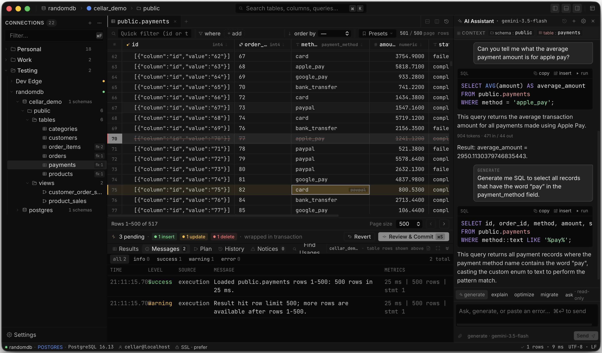

# Cellar

An open-source, cross-platform desktop database client with AI in the workflow, not stapled to the side.



Cellar is for developers, DBAs, and analysts who want a fast, dense, keyboard-first SQL workspace: browse schemas, run queries, inspect execution plans, edit result sets, and review database changes before they are committed. It is desktop-first, MIT licensed, and private by default.

> **Status:** early access. The app is a working vertical slice, not a production database client yet. Today it is strongest around PostgreSQL connection management, schema browsing, SQL execution, query history, execution plans, and the early editable-grid path.

## Principles

- **Desktop-first:** there is no web-hosted v1 target.
- **Private by default:** no telemetry, cloud sync, accounts, or crash upload without explicit opt-in.
- **Bring your own AI provider:** Cellar must not proxy AI requests through a hosted Cellar service.
- **SQL-native AI:** generated SQL should be inspectable, contextual, and gated before execution.
- **The grid matters:** result grids must be virtualized, editable, honest about pending changes, and safe around transactions.
- **Extensible by design:** drivers, AI providers, exporters, and renderers should be pluggable instead of hardcoded into app-only paths.

## What Works Today

- Tauri 2 desktop shell with React 18, TypeScript, Vite, Tailwind v4, and Zustand.
- Marketing/download site in `apps/site`.
- Typed Tauri IPC generated with `tauri-specta` into `packages/ipc`.
- Connection CRUD, test, connect, reconnect, and disconnect commands.
- OS-keychain credential storage via `cellar-secrets`.
- PostgreSQL driver with live connection pooling, schema introspection, query execution, table browsing, table-change commits, and `EXPLAIN` support.
- SQL Server/Azure SQL driver scaffolding with connection/query/introspection paths in progress.
- Query history storage and filtering.
- CodeMirror-based SQL editor package.
- Data grid package with editable cells, pending-change state, filters, frozen-column styling, and commit/revert hooks.
- Desktop UI for the sidebar tree, tabbed workspace, SQL editor, result grid, bottom messages/plan panels, connection dialog, command palette, settings, and commit preview.
- Rust and TypeScript test scaffolding around core contracts, IPC, grid behavior, state stores, SQL helpers, notices, and query messages.

## Not Done Yet

- Production-safe streaming or paged query results. Current execution still materializes rows and applies host-side caps.
- Query cancellation.
- Server-side grid pagination, sorting, filtering, and large-result virtualization.
- Broad database support. PostgreSQL is the real vertical slice; other engines are not ready for day-to-day use.
- Fully integrated `cellar-diff` review-and-commit flow for every editable-grid path.
- AI provider configuration, context chips, inline completion, and SQL generation.
- Plugin runtime and plugin SDK hardening.
- Signed installers, auto-update, CI, release packaging, and security-ready CSP.

Read [SPEC.md](SPEC.md) before making product or architectural changes. It is the canonical product spec.

## Quick Start

Prerequisites:

- Node.js 20 or newer
- pnpm 9 or newer
- Rust stable
- macOS users: Xcode command-line tools

```bash
git clone https://github.com/MRL-00/cellar.git
cd cellar
pnpm install
pnpm dev
```

`pnpm dev` runs the Tauri desktop app from `apps/desktop`. The helper starts Vite on port `1430` or the next available port, then opens the native app window.

Useful commands from the repo root:

```bash
pnpm typecheck
pnpm build
pnpm lint
pnpm test
cargo check --workspace
cargo test --workspace
```

Run the website locally:

```bash
pnpm --filter @cellar/site dev
```

Build a desktop bundle:

```bash
pnpm --filter @cellar/desktop build:tauri
```

## Repository Layout

```text
cellar/
├── apps/
│   ├── desktop/        # Tauri app shell, React frontend, Rust commands
│   └── site/           # Marketing/download site
├── crates/
│   ├── cellar-core/    # Shared Rust traits, errors, schema/query types
│   ├── cellar-drivers/ # First-party engine drivers
│   ├── cellar-sql/     # SQL parsing, formatting, dialect support
│   ├── cellar-diff/    # Pending grid edits to transactional SQL
│   ├── cellar-secrets/ # OS keychain and credential storage
│   └── cellar-plugin-host/
├── packages/
│   ├── ai/             # AI provider adapters and context pipeline
│   ├── data-grid/      # Custom grid package
│   ├── ipc/            # Generated TypeScript IPC bindings
│   ├── plugin-sdk/     # Plugin authoring interfaces
│   ├── sql-editor/     # CodeMirror SQL editor wrapper
│   └── ui/             # Shared UI primitives and tokens
├── docs/               # Architecture notes, ADRs, release notes
└── SPEC.md             # Canonical product and architecture spec
```

## Architecture

The intended runtime shape is:

```text
React frontend
  -> typed Tauri IPC
  -> Rust command/state layer
  -> cellar-core driver traits
  -> concrete database drivers
```

The frontend imports command wrappers from `@cellar/ipc`; it should not hand-maintain Rust-facing types. After changing Tauri commands or Rust IPC-facing types, regenerate the generated TypeScript bindings:

```bash
pnpm --filter @cellar/ipc codegen
```

Credential handling belongs in `cellar-secrets`. Connection configs must not contain passwords or provider keys.

## Roadmap

The roadmap is organized by product spine rather than version labels while the repo is early access.

1. **Stabilize the PostgreSQL vertical slice**
   - clearer connection and reconnect behavior
   - better typed errors and notices
   - safer row-limit handling
   - stronger Rust and frontend tests

2. **Make query execution production-shaped**
   - query IDs and cancellation
   - streamed or page-style result events
   - result memory caps
   - richer messages and execution-plan views

3. **Finish the grid edit and commit path**
   - complete `cellar-diff` integration
   - reviewable transactional SQL
   - optimistic concurrency checks
   - server-side sorting, filtering, pagination, and virtualization

4. **Broaden engine support**
   - harden SQL Server and Azure SQL
   - add MySQL and SQLite
   - keep dialect behavior in drivers and shared SQL/diff builders, not React components

5. **Add workflow-native AI**
   - BYO provider settings
   - inspectable schema/query context
   - generated SQL review gates
   - inline editor assistance

6. **Prepare for contributors and releases**
   - plugin runtime and SDK
   - contributor docs
   - CI, signing, updater, release packaging
   - security-ready Tauri CSP

## Website

The marketing site lives in `apps/site` and shares the product’s visual language and screenshots. Some website copy is intentionally aspirational; when code and copy disagree, treat `SPEC.md`, `AGENTS.md`, and the implemented command/driver surface as the source of truth.

## Contributing

Cellar is early, so small vertical slices are better than broad rewrites. Prefer existing patterns, keep IPC types generated, and keep source files under the 800-line project limit.

Before opening a pull request:

```bash
pnpm typecheck
pnpm test
cargo check --workspace
cargo test --workspace
```

Use Conventional Commit-style PR titles such as `feat: add scenario templates` or `fix: handle titlebar double-click`. Do not use `[codex]` or `codex:` prefixes.

## License

[MIT](LICENSE)
