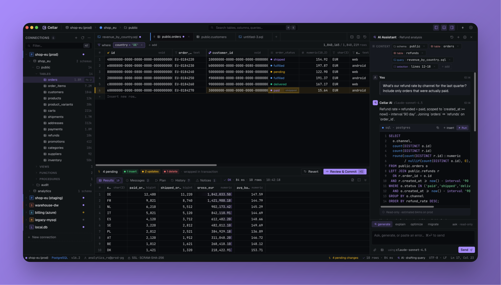
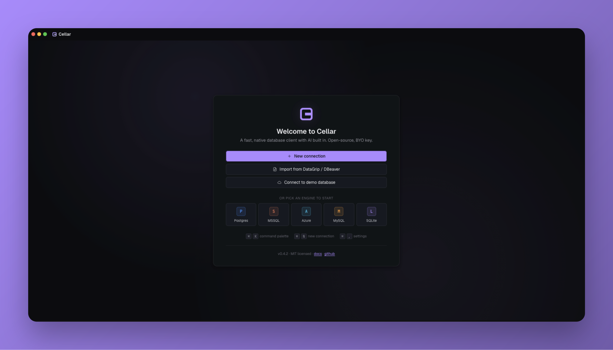
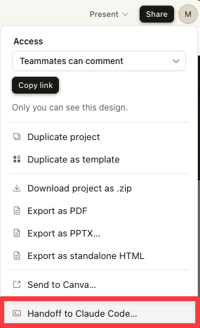
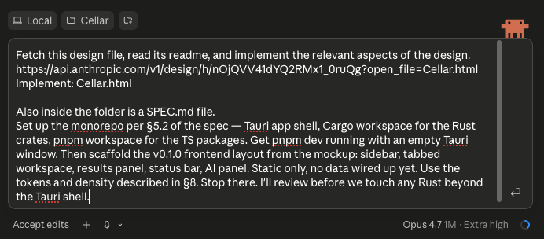

# Cellar

A fast, modern, open-source desktop database client — with AI in the workflow, not stapled to the side.



> **Status:** pre-alpha. The repo is a scaffold; only the v0.1.0 frontend layout is in place. Drivers, the data grid, the SQL editor, and the AI pipeline are stubbed. See [SPEC.md](./SPEC.md) §12 for the roadmap and [`docs/architecture/overview.md`](./docs/architecture/overview.md) for the architecture.

---

## What it is

Cellar targets the same audience as DataGrip, TablePlus, and DBeaver: developers, DBAs, and analysts who work with multiple databases daily and need a fast, ergonomic environment for browsing, querying, editing, and shipping schema and data changes.

Three convictions shape it:

1. **The existing tools are either heavy, closed-source, or thin.** There is room for a fast, modern, open-source client that takes the DataGrip feature set seriously.
2. **AI belongs in the workflow.** Schema-aware completion in the editor, context-aware chat, and explainable SQL generation should be first-class.
3. **Extensibility is a feature.** Drivers, AI providers, exporters, and renderers should all be pluggable.

MIT licensed. No paid tier. No telemetry without opt-in.



---

## Stack

| Layer | Choice |
|---|---|
| Desktop shell | Tauri 2 |
| Frontend | React 18 + TypeScript + Vite |
| State | Zustand |
| Styling | CSS variables (design tokens) |
| Data grid | Custom, on TanStack Table v8 |
| SQL editor | CodeMirror 6 |
| Backend | Rust (stable) |
| DB drivers | `sqlx` (Postgres / MySQL / SQLite), `tiberius` (SQL Server) |
| Package mgmt | pnpm workspaces + Cargo workspaces |
| Monorepo | Turborepo |

Full rationale: [SPEC.md §4](./SPEC.md#4-stack).

---

## Quick start

Prerequisites: **Node ≥ 20**, **pnpm ≥ 9**, **Rust (stable)** with the standard `cargo` toolchain. On macOS you'll also need Xcode command-line tools.

```bash
# Clone and install everything (TS + Rust deps resolve on first run)
git clone https://github.com/MRL-00/cellar.git
cd cellar
pnpm install

# Run the desktop app (Tauri dev — opens a native window with HMR)
pnpm dev
```

That's it. `pnpm dev` runs `tauri dev` inside `apps/desktop`, which spawns the Vite dev server starting at `localhost:1430` and falls forward to the next free port if needed, then opens the app window.

Other useful scripts (all from the repo root):

```bash
pnpm build                         # turbo: build every workspace package
pnpm typecheck                     # tsc --noEmit across TS packages
pnpm --filter @cellar/desktop build:tauri   # produce a signed-ish bundle
cargo check --workspace            # check every Rust crate
cargo test  --workspace            # run Rust tests
```

---

## Repository layout

Per [SPEC.md §5.2](./SPEC.md#52-repository-layout):

```
cellar/
├── apps/desktop/        # Tauri app shell (frontend + Rust commands)
├── crates/              # Rust workspace
│   ├── cellar-core/         # Traits, errors, shared types
│   ├── cellar-drivers/      # Per-engine drivers
│   ├── cellar-sql/          # SQL parsing, dialect handling
│   ├── cellar-diff/         # Pending changes → SQL
│   ├── cellar-secrets/      # Credential storage
│   └── cellar-plugin-host/  # External plugin loading
├── packages/            # pnpm workspace
│   ├── ui/                  # Shared component library
│   ├── data-grid/           # The grid (its own package)
│   ├── sql-editor/          # CodeMirror wrapper
│   ├── ipc/                 # Generated TS bindings from Rust commands
│   ├── ai/                  # AI providers, prompts, context building
│   └── plugin-sdk/          # SDK for community plugin authors
├── plugins/             # First-party plugins
├── docs/                # Architecture, ADRs, contributor guides
├── examples/            # Docker compose for local DBs, sample data
└── scripts/             # Build, codegen, release helpers
```

---

## Roadmap

The plan is documented in [SPEC.md §12](./SPEC.md#12-roadmap). Short version:

- **v0.1.0** — Postgres driver, connection management, schema tree, SQL editor, read-only grid
- **v0.2.0** — Cell/row/column editing, Review & Commit, FK navigation, history, settings
- **v0.3.0** — MySQL, SQLite, SQL Server, Azure SQL; execution plans; dialect handling
- **v0.4.0** — AI panel (chat, context chips, generated SQL) + inline editor completion
- **v0.5.0** — Plugin SDK + runtime, exporters, auto-updater
- **v1.0.0** — Signed, notarized binaries for macOS, Windows, Linux

---

## Contributing

Issues and discussion happen on GitHub. Architectural changes should land as an ADR in `docs/architecture/adr/` before code.

When `CONTRIBUTING.md` lands it'll cover setup, code style, and PR guidelines. In the meantime: open an issue, fork, branch, PR.

---

## License

[MIT](./LICENSE) — to be added in the first tagged release.

---

## How this was built

Cellar's design was prototyped in [Claude Design](https://claude.ai/design), exported as a handoff bundle, and implemented by Claude Code against [SPEC.md](./SPEC.md).

<table>
<tr>
<td width="50%">

**1. Design handoff**

The design tool exports a tarball with the prototype HTML, components, design tokens, and chat transcripts.

</td>
<td width="50%">

**2. The implementation prompt**

The whole scaffold landed from a single prompt pointing Claude Code at the design bundle and the spec.

</td>
</tr>
<tr>
<td></td>
<td></td>
</tr>
</table>
